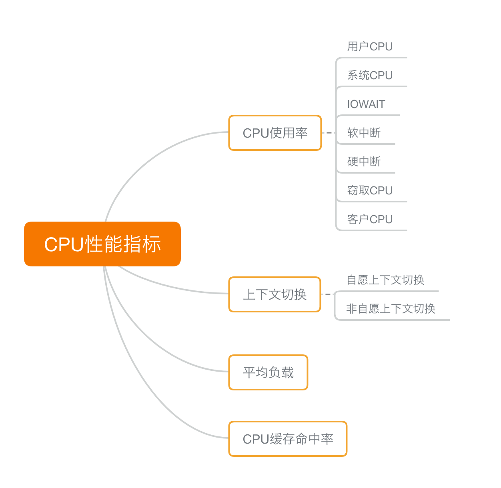

## CPU 性能指标总结

在排查系统性能瓶颈的时候,首先要对 CPU 性能的指标有所了解,如下思维导图:

### CPU 使用率

1. 用户CPU: 表示 CPU 时间在用户空间占用较多, 通常应用程序比较繁忙会导致指标升高.
2. 系统CPU: 这里不包括中断,通常表示内核比较繁忙。
3. 等待 I/O: 表示等待 I/O 所占用时间, 通常说明系统与硬件交互时间比较长.
4. 软中断和硬中断的 CPU 使用率，分别表示内核调用软中断处理程序、硬中断处理程序的时间百分比。它们的使用率高，通常说明系统发生了大量的中断

### 上下文切换

1. 自愿上下文切换: 通常是由于需要等待系统资源,或者主动挂起触发.
2. 非自愿上下文切换: 通常是由于 CPU 时间片到了, 被强制调度.

上下文切换，本身是保证 Linux 正常运行的一项核心功能。但过多的上下文切换，会将原本运行进程的 CPU 时间，消耗在寄存器、内核栈以及虚拟内存等数据的保存和恢复上，缩短进程真正运行的时间，成为性能瓶颈。

### 平均负载

这个比较好理解,就是过去 1, 5, 15 分钟内的系统负载,理想情况下**平均负载应该等于 CPU 的个数** 表示 CPU 被充分利用, 当超过 CPU 个数时, 表示系统负载压力比较大了.

### CPU 缓存命中率

由于 CPU 的处理速度要比内存快的多, CPU 在访问内存的时候, CPU 就会等待内存的响应, 为了协调者俩者的速度, 就出现了多级缓存，处于 CPU 和 内存之间, 其中保存的是内存的热点数据, L1-L3 1-3级缓存, L1 和 L2 常用在单核中, L3 则用在多核中.

缓存的命中率,是和衡量 CPU 缓存的复用情况, 命中率越高, 代表处理的性能越好.

## 性能工具

在排查性能指标时,需要通过各种各样的工具,其中工具的选项已经作用,可以通过man手册查看.

要把性能指标和工具关联起来,就是说当要查看某个指标时,要知道那个工具可以做到.

反过来还要知道哪些工具可以查看哪些性能指标,使用现有的工具查看相关的指标,因为在生产环境中, 不一定有权限安装新的工具.

### 如何迅速分析 CPU 的性能瓶颈

当分析一个问题的时候, 一个个指标排查起来效率太慢了,CPU 性能指标都是存在关联性的, 这就就需要明白每个指标背后的原理，

举个例子，用户 CPU 使用率高，我们应该去排查进程的用户态而不是内核态。因为用户 CPU 使用率反映的就是用户态的 CPU 使用情况，而内核态的 CPU 使用情况只会反映到系统 CPU 使用率上。

为了缩小排查范围，我通常会先运行几个支持指标较多的工具，如 top、vmstat 和 pidstat

在排查某个问题时,需要多个工具交叉对比验证,不能盲目确认问题的原因.

## CPU 性能优化思路

在排查出 CPU 的性能瓶颈的时候, 接下来就是优化问题, 也就是找到充分利用 CPU 的方法, 以处理更多的事情。

### 性能优化的方法论

在找到问题后,是不是要立即开始优化,首先考虑一下下面的问题.

- 首先，既然要做性能优化，那要怎么判断它是不是有效呢？特别是优化后，到底能提升多少性能呢？

- 第二，性能问题通常不是独立的，如果有多个性能问题同时发生，你应该先优化哪一个呢？

- 第三，提升性能的方法并不是唯一的，当有多种方法可以选择时，你会选用哪一种呢？是不是总选那个最大程度提升性能的方法就行了呢？

### 如何评估性能优化的效果

1. 确定性能的量化指标: 比如 CPU 使用率,客户端请求延迟,上下文切换严重.如何选择指标来评估, 那就是多维度来寻找量化指标, 至少在应用程序和系统资源这两个维度之间, web应用程序举例
   1. 应用程序的维度，我们可以用吞吐量和请求延迟来评估应用程序的性能
   2. 系统资源的维度，我们可以用 CPU 使用率来评估系统的 CPU 使用情况
2. 测试优化前的性能指标
3. 测试优化后的性能指标

### 多个性能问题同时存在的时候，要如何选择

有一个流传很广的说法是 **"二八法则"** 也就是说 80% 的问题往往都是由 20% 的代码导致的, 只要找到这 20% 的位置就可以优化 80% 的问题, 也就是说不是所有问题都值得优化,只需要优化顶层出现问题的根源，相关联的问题也许都会解决了。

这里还是回到 如何找到什么性能的问题最重要:

1. 首先可以逐个分析性能指标,在排除掉因果关联的性能问题后, 在对剩下的问题进行优化.
2. 如果剩下的问题还是好几个，那就逐个优化测试,对比不同的优化结果，选择能够明显提升性能的问题进行修复。可以通过优先级来逐个排查，比如:
   1. 当 CPU 资源占用 100% 时，那么首先要优化的就这 占用率, 然后在考虑其他问题.
   2. 针对不同类型的指标,首先优化哪些由瓶颈导致的性能指标变化幅度大的问题,当出现系统瓶颈的时候，用户 CPU 增加了 10% 系统 CPU 增加了 50% 那么就优先优化系统 CPU 占用时间。

### 有多种优化的方式的时候,如何选择

当存在多种优化的方式的时候,并不建议一下子就选择优化幅度高的方法,还要考虑会不会引起其他指标的异常,或者应用程序的异常.

## CPU 优化

这里只考虑系统层面的优化，不考虑代码层面，因为对开发不是很擅长....

一些常见的方法:

1. CPU 绑定：把进程绑定到一个或者多个 CPU 上，可以提高 CPU 缓存的命中率，减少跨 CPU 调度带来的上下文切换问题。

2. CPU 独占：跟 CPU 绑定类似，进一步将 CPU 分组，并通过 CPU 亲和性机制为其分配进程。这样，这些 CPU 就由指定的进程独占，换句话说，不允许其他进程再来使用这些 CPU。

3. 优先级调整：使用 nice 调整进程的优先级，正值调低优先级，负值调高优先级。在这里，适当降低非核心应用的优先级，增高核心应用的优先级，可以确保核心应用得到优先处理。

4. 为进程设置资源限制：使用 Linux cgroups 来设置进程的 CPU 使用上限，可以防止由于某个应用自身的问题，而耗尽系统资源。

5. NUMA（Non-Uniform Memory Access）优化：支持 NUMA 的处理器会被划分为多个 node，每个 node 都有自己的本地内存空间。NUMA 优化，其实就是让 CPU 尽可能只访问本地内存。

6. 中断负载均衡：无论是软中断还是硬中断，它们的中断处理程序都可能会耗费大量的 CPU。开启 irqbalance 服务或者配置 smp_affinity，就可以把中断处理过程自动负载均衡到多个 CPU 上。
