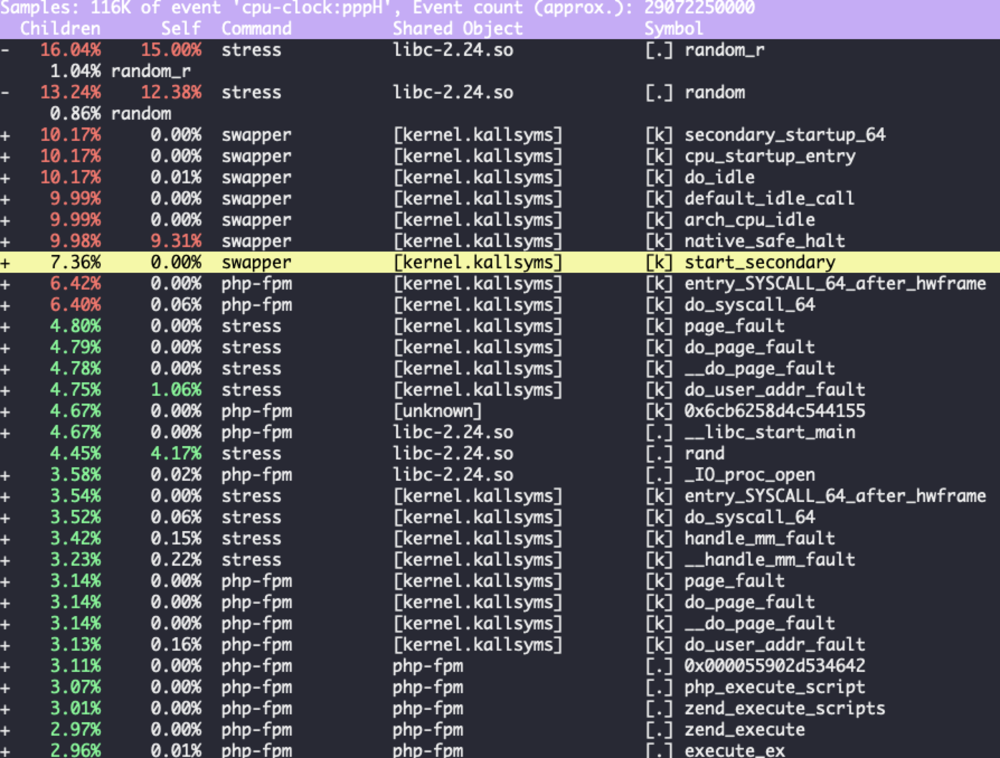

## CPU 使用率

Linux 在运行任务的时候,通过 cpu 的时间划分为多个时间片，轮流来分配给进程使用。

Linux 通过内核中定义的 **HZ(节拍率)**,来触发时间中断,并使用全局变量 `jiffies` 记录了开机以来的节拍数量, 每发生一次时间中断, `jiffies` 的值就加 1, `jiffies` 可以理解为发生时间中断的总数, 而 `HZ` 可以理解为每秒触发多少次的时间中断. 节拍率是内核可配置项, 通过 `/boot/config` 可以查看他的配置。该中断的作用是为了定时更新系统日期和时间，使系统时间不断地得到跳转

```bash
cat /boot/config-$(uname -r)  |grep CONFIG_HZ
CONFIG_HZ_250=y
CONFIG_HZ=250
```

由于节拍率是内核选项, 所以用户空间不能直接访问, 为了方便用户空间直接使用, 内核还提供了一个用户空间节拍率, 它的值是固定的 100 也就是 1/100(10ms), 用户空间的进程使用这个值.

`/proc/stat` 提供的是系统的 CPU 和任务统计信息。比方说，如果你只关注 CPU 的话，可以执行下面的命令:

```bash
# 只保留各个 CPU 的数据
$ cat /proc/stat | grep ^cpu
cpu 280580 7407 286084 172900810 83602 0 583 0 0 0
cpu0 144745 4181 176701 86423902 52076 0 301 0 0 0
cpu1 135834 3226 109383 86476907 31525 0 282 0 0 0
```

第一行表示的是所有 CPU 的累加。其他列则表示不同场景下 CPU 的累加节拍数，它的单位是 USER_HZ，也就是 10 ms（1/100 秒），所以这其实就是不同场景下的 CPU 时间。

各列的参数可以通过 `man proc` 来查看细节

### CPU 使用率计算

通过 `/proc/stat` 来查看系统 cpu 使用情况

CPU 使用率，就是除了空闲时间外的其他时间占总 CPU 时间的百分比:

```text
CPU 使用率 = 1 - 空闲时间/总 CPU 时间
```

这里通过开机以来的节拍数累加值来计算, 所以是开机以来的平均cpu使用率,没什么参考价值, 一般为了计算cpu使用率都是取间隔时间内的使用率.

```text
时间单位内 CPU 使用率 = 1 - (new_idletime - old_idletime) / (new_totaltime - old_totaletime)
```

### 查看 CPU 使用率

通过一些工具来查看 CPU 使用率, 如 `htop` `top` `ps` `atop` 这些性能工具都是给出一段时间的平均 CPU 使用率,所以要注意间隔时间设置.如果多个工具对比分析要保证有相同的间隔时间.

比如，对比一下 top 和 ps 这两个工具报告的 CPU 使用率，默认的结果很可能不一样，因为 top 默认使用 3 秒时间间隔，而 ps 使用的却是进程的整个生命周期。

- top 显示了系统总体的 CPU 和内存使用情况,以及各个进程的资源使用情况, 各个进程中的 CPU 使用率, 是包含用户空间和内核空间使用率的总和.
- pidstat 可以查看每个进程中用户态和内核态的 CPU 使用率.
- ps 则只显示了每个进程的资源使用情况.

## CPU 使用率过高怎么办

通过上面等工具可以定位到具体的单个进程的 CPU 使用率较高的进程, 通过 `perf` 常用来分析系统的各种事件和内核性能,还可以用来分析应用程序的性能问题。

`perf` 中分析 `CPU` 的 2 中最常见的用法:

- `perf top` 类似与 top 实时显示占用 CPU 时钟最多的函数或者指令.

```bash
$ perf top
Samples: 833  of event 'cpu-clock', Event count (approx.): 97742399
Overhead  Shared Object       Symbol
   7.28%  perf                [.] 0x00000000001f78a4
   4.72%  [kernel]            [k] vsnprintf
   4.32%  [kernel]            [k] module_get_kallsym
   3.65%  [kernel]            [k] _raw_spin_unlock_irqrestore
...
```

1. Samples: 采样数
2. event: 事件类型
3. event count: 事件类型总数

1. 第一列 `Overhead`: 是该符号的性能事件在所有采样中的比例，用百分比来表示。
2. 第二列 `Shared`: 是该函数或指令所在的动态共享对象(Dynamic Shared Object)如内核、进程名、动态链接库名、内核模块名等。
3. 第三列 `Object`: 是动态共享对象的类型。比如 [.] 表示用户空间的可执行程序、或者动态链接库，而 [k] 则表示内核空间。
4. 最后一列 `Symbol`: 是符号名，也就是函数名。当函数名未知时，用十六进制的地址来表示。

- `perf record` 和 `perf report` record 提供了数据保存的功能, 而保存的数据可以使用 report 来查看,用于离线分析. 通过 -g 还可以开启调用关系采样.

### CPU 占用率高，但是找不到占用进程

在排查 CPU 占用率高的时候,还有可能出现一种情况,那就是 CPU 占用率很高, 可是通过工具却看不到占用 CPU 高的进程.

top 信息可以看到 CPU 已经 90% 了, 但是最多的是 Docker, 也才 14% 加起来也没有使用那么多。

```bash
top - 18:06:21 up 1 day,  2:11,  2 users,  load average: 4.66, 2.02, 0.83
Tasks: 248 total,   7 running, 242 sleeping,   0 stopped,   1 zombie
%Cpu(s): 60.1 us, 25.5 sy,  0.0 ni,  8.1 id,  0.0 wa,  0.0 hi,  6.3 si,  0.0 st
MiB Mem :   2957.5 total,    172.2 free,    480.3 used,   2305.0 buff/cache
MiB Swap:   2048.0 total,   2046.7 free,      1.3 used.   2259.4 avail Mem

    PID USER      PR  NI    VIRT    RES    SHR S  %CPU  %MEM     TIME+ COMMAND
  66148 root      20   0  712848   8544   6312 S  14.3   0.3   0:18.72 containerd-shim
  66207 systemd+  20   0   33132   3816   2392 S   9.6   0.1   0:13.32 nginx
  75634 daemon    20   0  336692  16244   8572 S   7.6   0.5   0:08.50 php-fpm
  75645 daemon    20   0  336692  16500   8828 S   6.6   0.5   0:07.46 php-fpm
  75651 daemon    20   0  336692  16500   8828 S   6.6   0.5   0:07.45 php-fpm
  75629 daemon    20   0  336692  16500   8828 S   6.3   0.5   0:08.46 php-fpm
  75635 daemon    20   0  336692  16268   8596 S   6.3   0.5   0:08.22 php-fpm
  54015 root      20   0 1605752  84496  53240 S   4.3   2.8   0:42.13 dockerd
     30 root      20   0       0      0      0 S   3.3   0.0   0:21.50 ksoftirqd/3
    821 root      20   0 1492764  43852  28924 S   0.7   1.4   5:10.69 containerd
  66208 systemd+  20   0   33132   3804   2392 S   0.7   0.1   0:00.74 nginx
 278789 daemon    20   0    4288    744    672 S   0.0   0.0   0:00.00 sh
 278790 daemon    20   0    7280    824    740 S   0.0   0.0   0:00.00 stress
 278791 daemon    20   0    4288    792    716 S   0.0   0.0   0:00.00 sh
 278793 daemon    20   0    4288    740    668 S   0.0   0.0   0:00.00 sh
 278794 daemon    20   0    7280    880    800 S   0.0   0.0   0:00.00 stress
 278796 daemon    20   0    7280    868    784 R   0.0   0.0   0:00.00 stress
 278797 daemon    20   0    4288    756    684 S   0.0   0.0   0:00.00 sh
 278798 daemon    20   0    4288    764    692 S   0.0   0.0   0:00.00 sh
 278799 daemon    20   0    8180    100      0 R   0.0   0.0   0:00.00 stress
 278800 daemon    20   0    7280    880    800 S   0.0   0.0   0:00.00 stress
 278801 daemon    20   0    8180    812    524 R   0.0   0.0   0:00.00 stress
```

在观察运行任务队列: 就绪队列中有 7 个进程, 这个是因为我们使用 ab 模拟的 5 个并发对网站进行压力测试，加上一个 nginx 应该是 6 个任务, 任务数量差不多.

但是通过观察发现, 相关 nginx 和 php 都处于 S 状态, 那到底是什么在运行呢. 可以发现是一些 sh 和 stress 进程在运行。

通过 `pidstat -p 7280` 查看进程信息.却发现查不到, 然后通过 `ps -elf ｜ grep 7280` 发现没有这个进程, 这种情况无非 2 中情况,一种是进程不断重启,要么就是全新的进程, 也就是说这个进程也许在不断重启, 或者执行的任务时间比较短,结束时间比较快.

通过 pstree 来查看异常进程的父进程, 发现就是容器中的 php 这个进程导致的.

```bash
# 由于进程一直重新生成 可能一次捕捉不到

$ pstree  | grep -B 5 stress
        |-containerd-shim-+-php-fpm-+-3*[php-fpm]
        |                 |         `-2*[php-fpm---sh---stress]
```

通过查看容器中的工作目录,查找相关代码

```bash
# 拷贝源码到本地
$ docker cp phpfpm:/app .

$ grep stress -r app
app/index.php:// fake I/O with stress (via write()/unlink()).
app/index.php:$result = exec("/usr/local/bin/stress -t 1 -d 1 2>&1", $output, $status);

# 再来看看 app/index.php 的源代码：
$ cat app/index.php
<?php
// fake I/O with stress (via write()/unlink()).
$result = exec("/usr/local/bin/stress -t 1 -d 1 2>&1", $output, $status);
if (isset($_GET["verbose"]) && $_GET["verbose"]==1 && $status != 0) {
  echo "Server internal error: ";
  print_r($output);
} else {
  echo "It works!";
}
?>
```

可以看到，源码里对每个请求都会调用一个 stress 命令，模拟 I/O 压力。从注释上看，stress 会通过 write() 和 unlink() 对 I/O 进程进行压测，看来，这应该就是系统 CPU 使用率升高的根源了。不过，stress 模拟的是 I/O 压力，而之前在 top 的输出中看到的，却一直是用户 CPU 和系统 CPU 升高，并没见到 iowait 升高。这又是怎么回事呢？stress 到底是不是 CPU 使用率升高的原因呢？查看请求日志

```bash
$ curl 10.0.23.31:10000?verbose=1
Server internal error: Array
(
    [0] => stress: info: [431261] dispatching hogs: 0 cpu, 0 io, 0 vm, 1 hdd
    [1] => stress: FAIL: [431262] (563) mkstemp failed: Permission denied
    [2] => stress: FAIL: [431261] (394) <-- worker 431262 returned error 1
    [3] => stress: WARN: [431261] (396) now reaping child worker processes
    [4] => stress: FAIL: [431261] (400) kill error: No such process
    [5] => stress: FAIL: [431261] (451) failed run completed in 0s
)
```

看错误消息 `mkstemp failed: Permission denied` ，以及` failed run completed in 0s`。原来 stress 命令并没有成功，它因为权限问题失败退出了。看来，我们发现了一个 PHP 调用外部 stress 命令的 bug：没有权限创建临时文件。

从这里我们可以猜测，正是由于权限错误，大量的 stress 进程在启动时初始化失败，进而导致用户 CPU 使用率的升高。如何证实这个猜测, 在前面使用的工具中并未发现大量的 stress 进程, 这时候我们可以使用 perf 命令,

```bash
# 记录性能事件，等待大约 15 秒后按 Ctrl+C 退出
$ perf record -g

# 查看报告
$ perf report
```



可以看到是由于大量的 stress 调用 randon（）这个函数, 占用了大部分的时钟事件，由此可以确定是由于 stress 导致的, 只要修复权限问题，并减少或删除 stress 的调用，就可以减轻系统的 CPU 压力。
